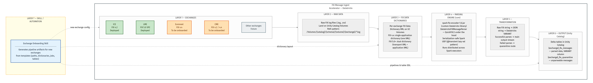

# FIX Message Ingest Accelerator

A reusable toolkit for parsing **FIX (Financial Information eXchange) protocol** messages from commodity and financial exchanges into structured Delta tables on Databricks. Built for StoneX to rapidly onboard new exchanges into their Unified Data Platform (UDP).

## Architecture



```
┌─────────────────────────────────────────────────────────────────────────────────────────┐
│                                      EXCHANGES                                          │
│                                                                                         │
│   ┌───────────┐  ┌───────────┐  ┌──────────────┐  ┌───────────┐  ┌──────────────────┐  │
│   │    ICE     │  │    LME    │  │  Euronext    │  │    CME    │  │ Other Exchanges  │  │
│   │  FIX 4.2  │  │ FIX 5.0SP2│  │   FIX 4.4    │  │ FIX 4.2/  │  │     Future       │  │
│   │ DEPLOYED  │  │ DEPLOYED  │  │  ONBOARDING  │  │    4.4    │  │                  │  │
│   └─────┬─────┘  └─────┬─────┘  └──────┬───────┘  └─────┬─────┘  └────────┬─────────┘  │
│         │               │               │                │                 │             │
└─────────┼───────────────┼───────────────┼────────────────┼─────────────────┼─────────────┘
          │               │               │                │                 │
          ▼               ▼               ▼                ▼                 ▼
┌─────────────────────────────────────────────────────────────────────────────────────────┐
│  RAW FIX DATA — Unity Catalog Volumes                                                   │
│  /Volumes/{catalog}/{schema}/{volume}/{exchange}/*.log                                  │
│                                                                                         │
│  • ICE:  text log files (one FIX message per line)                                      │
│  • LME:  CSV files (FIX message in column _c11)                                        │
│  • New exchanges: text or CSV depending on connectivity                                 │
└─────────────────────────────────────────┬───────────────────────────────────────────────┘
                                          │
          ┌───────────────────────────────┤
          ▼                               ▼
┌─────────────────────────┐  ┌───────────────────────────────────────────────────────────┐
│  FIX DATA DICTIONARIES  │  │  PARSING ENGINE                                           │
│  (UC Volumes)           │  │                                                           │
│                         │  │  ┌─────────────────────────────────────┐                  │
│  FIX 4.x (single):     │  │  │  spark-fix-encoder-1.0.jar          │                  │
│   • 1 transport XML     │──▶  │  DatabricksFIXMessageParser          │                  │
│                         │  │  │  (QuickFIX/J under the hood)        │                  │
│  FIX 5.0+ (dual):      │  │  └──────────────┬──────────────────────┘                  │
│   • 1 transport XML     │  │                 │                                          │
│   • 1 application XML   │  │  ┌──────────────▼──────────────────────┐                  │
│                         │  │  │  Spark UDF                           │                  │
│  Per-exchange custom    │  │  │  @transient lazy val per executor    │                  │
│  dictionaries           │  │  │  Distributed across cluster          │                  │
└─────────────────────────┘  │  └──────────────┬──────────────────────┘                  │
                             └─────────────────┼─────────────────────────────────────────┘
                                               │
                                               ▼
┌─────────────────────────────────────────────────────────────────────────────────────────┐
│  TRANSFORMATION                                                                         │
│                                                                                         │
│  Raw FIX string ──▶ JSON string ──▶ Databricks VARIANT                                 │
│                                         │                                               │
│                              ┌──────────┴──────────┐                                    │
│                              ▼                     ▼                                    │
│                      Parse succeeded         Parse failed                               │
└──────────────────────────────┬─────────────────────┬────────────────────────────────────┘
                               │                     │
                               ▼                     ▼
┌─────────────────────────────────────────────────────────────────────────────────────────┐
│  OUTPUT — Delta Tables in Unity Catalog                                                 │
│                                                                                         │
│  ┌──────────────────────────────────┐  ┌──────────────────────────────────┐             │
│  │  {exchange}_fix_messages         │  │  {exchange}_fix_quarantine       │             │
│  │                                  │  │                                  │             │
│  │  • fixMessage (raw string)       │  │  • fixMessage (raw string)       │             │
│  │  • jsonData (parsed JSON)        │  │  • fileName                      │             │
│  │  • fixVariant (VARIANT type)     │  │  • rowNumber                     │             │
│  │  • fileName, rowNumber           │  │  • exchange                      │             │
│  │  • exchange, parsedAt            │  │  • quarantinedAt                 │             │
│  └──────────────────────────────────┘  └──────────────────────────────────┘             │
└─────────────────────────────────────────────────────────────────────────────────────────┘
```

## Current State

| Exchange | FIX Version | Dictionary Mode | Status |
|----------|-------------|-----------------|--------|
| **ICE** | 4.2 | Single | Deployed (prototype) |
| **LME** | 5.0 SP2 / FIXT 1.1 | Dual | Deployed (prototype) |
| **Euronext** | 4.4 (Optiq) | Single | To be onboarded |
| **CME** | 4.2 / 4.4 | Single | To be onboarded |

## Repository Structure

```
fix-message-ingest-accelerator/
│
├── README.md                              ← You are here
├── spark-fix-encoder-1.0.jar              ← Core parsing library (install on cluster)
├── anant FIX Parser V2.ipynb              ← Original prototype notebook (ICE + LME)
│
├── docs/
│   ├── architecture.png                   ← Architecture diagram
│   └── architecture.mmd                   ← Mermaid source (editable)
│
└── skills-based-approach/
    ├── SKILL.md                           ← Cursor Agent Skill (for local dev scaffolding)
    ├── exchange-config-template.json      ← Parameterized exchange config template
    ├── reference.md                       ← FIX protocol details & troubleshooting guide
    ├── examples.md                        ← Worked examples (ICE, LME, Euronext, CME)
    ├── templates/
    │   ├── exchange-pipeline.scala        ← Code-generation template (Cursor use)
    │   └── fix-parse-udf.scala            ← Reusable UDF pattern reference
    │
    └── databricks-deployable/             ★ DEPLOY THIS TO DATABRICKS
        ├── DEPLOYMENT_GUIDE.md            ← Step-by-step deployment instructions
        ├── FIX_Exchange_Parser.scala      ← Universal notebook — works for ANY exchange
        └── assistant-instructions.md      ← Custom instructions for Databricks AI Assistant
```

## Quick Start: Onboard a New Exchange

### Prerequisites

1. **Databricks cluster** with `spark-fix-encoder-1.0.jar` installed as a cluster library
2. The exchange's **FIX data dictionary XML** uploaded to a Unity Catalog Volume
3. **Raw FIX log files** accessible on a Unity Catalog Volume
4. A **target catalog and schema** in Unity Catalog

### Option A: Use the Universal Notebook (Recommended)

Import `skills-based-approach/databricks-deployable/FIX_Exchange_Parser.scala` into your Databricks workspace. This is a single, ready-to-run notebook that handles **any exchange** — no code changes required. Just fill in the widgets:

| Widget | Description | Example |
|--------|-------------|---------|
| `exchange_name` | Short uppercase identifier | `EURONEXT` |
| `fix_version` | FIX protocol version | `4.2`, `4.4`, `5.0SP2` |
| `dictionary_mode` | `single` (FIX 4.x) or `dual` (FIX 5.0+) | `single` |
| `transport_dict_path` | Volume path to transport dictionary XML | `/Volumes/users/.../EURONEXT.FIX44.xml` |
| `application_dict_path` | Volume path to app dictionary (dual only) | *(leave empty for single)* |
| `source_format` | `text` or `csv` | `text` |
| `source_path` | Volume path/glob for raw data | `/Volumes/data/euronext/*.log` |
| `csv_fix_column` | CSV column with FIX message (csv only) | `_c11` |
| `target_table` | Full Unity Catalog table path | `prod_trading.fix_parsed.euronext_fix_messages` |
| `quarantine_table` | Table for unparseable messages | `prod_trading.fix_parsed.euronext_fix_quarantine` |

Click **Run All**. The notebook will validate the dictionary, parse every message, write to Delta, and print a summary.

For full deployment instructions see [DEPLOYMENT_GUIDE.md](skills-based-approach/databricks-deployable/DEPLOYMENT_GUIDE.md).

### Option B: Use the Databricks AI Assistant

Optionally, load `skills-based-approach/databricks-deployable/assistant-instructions.md` into your workspace's AI Assistant custom instructions. Then ask the assistant "Help me onboard Euronext" and it will guide you through the widget configuration interactively.

### After Running

1. **Review the parsing summary** — the notebook prints total, success, and quarantine counts
2. **Check the quarantine table** for unparseable messages:
   ```sql
   SELECT * FROM prod_trading.fix_parsed.euronext_fix_quarantine LIMIT 20;
   ```
3. **Schedule as a Databricks Job** once validated

## How the Parser Works

The pipeline follows the same pattern for every exchange:

```
1. INGEST     spark.read.text() or spark.read.csv()
                 ↓
2. CONFIGURE  DatabricksFIXMessageParser + FIX Dictionary XML(s)
                 ↓
3. PARSE      Spark UDF calls parseFIXMessageToJSONString()
              distributed across executors via @transient lazy val
                 ↓
4. TRANSFORM  JSON string → CAST(jsonData AS VARIANT)
                 ↓
5. ROUTE      Success → main table | Failure → quarantine table
                 ↓
6. WRITE      Delta table in Unity Catalog
```

### The UDF Serialization Pattern

The `DatabricksFIXMessageParser` is **not serializable**. It cannot be passed directly into a Spark UDF closure. The solution is `@transient lazy val` — each executor lazily creates its own parser instance using the serializable dictionary path string:

```scala
class ExchangeParseUDF(dictPath: String) extends UDF1[String, String] with Serializable {
  @transient private lazy val parser: DatabricksFIXMessageParser = {
    val p = new DatabricksFIXMessageParser()
    p.addFIXDataSource(dictPath)
    p
  }
  override def call(s: String): String = parser.parseFIXMessageToJSONString(s)
}
```

This is the single most important implementation detail. The original prototype had a version without this pattern that would fail at scale.

## Key Dependencies

| Component | Purpose |
|---|---|
| `spark-fix-encoder-1.0.jar` | Custom Databricks library wrapping the FIX parser |
| **QuickFIX/J** | Industry-standard open-source FIX engine (bundled in JAR) |
| **Databricks Runtime 14.x+** | Required for `VARIANT` type support |
| **Unity Catalog** | Storage for Volumes (source data, dictionaries) and Delta tables |

## Troubleshooting

| Problem | Likely Cause | Solution |
|---|---|---|
| `ConfigError` on dictionary load | Malformed XML or encoding issue | See `reference.md` — validate XML, check for BOM bytes |
| `InvalidMessage` during parsing | Message doesn't match dictionary | Check FIX version, custom tags, delimiters |
| `NotSerializableException` | Parser passed directly to UDF | Use `@transient lazy val` pattern (see templates) |
| Low success rate | Wrong dictionary for the data | Verify the dictionary version matches the source messages |
| Out of memory on executors | Large dictionary + many cores | Increase executor memory — each core loads one dictionary instance |
